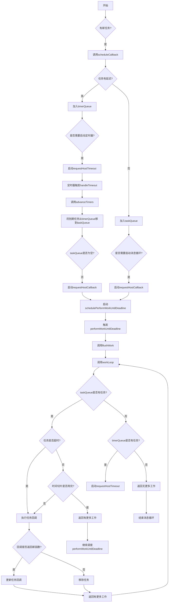

### 流程图说明
1. 任务调度流程 ：
   
   - 新任务通过 scheduleCallback 函数进入调度器
   - 根据任务是否有延迟，分别加入 timerQueue 或 taskQueue
   - 有延迟的任务会启动定时器，到期后自动移到 taskQueue
2. 任务执行流程 ：
   
   - 当 taskQueue 有任务时，启动消息循环
   - 通过 performWorkUntilDeadline 函数执行工作
   - 每个任务在时间切片内执行，时间切片用完后交还控制权
   - 任务执行完成后，继续执行下一个任务
3. 时间切片机制 ：
   
   - 每个时间切片默认5毫秒
   - 通过 shouldYieldToHost 函数判断是否需要交还控制权
   - 确保主线程不会被长时间阻塞
